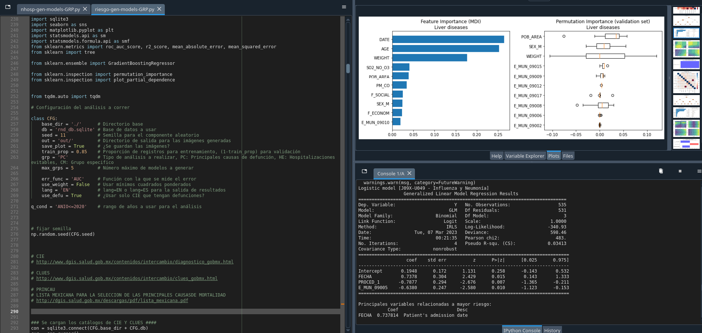

# Generación automatizada de modelos predictivos del número y severidad de las hospitalizaciones por enfermedades y categorías de enfermedades
Mediante el análisis de datos de egresos hospitalarios, se ha desarrollado un sistema automatizado para la generación de modelos predictivos del número y la severidad de hospitalizaciones por diversas enfermedades y categorías, seleccionando los códigos CIE o grupos de códigos a modelar. Para tal fin, se han empleado técnicas estadísticas, tales como la regresión logística y la regresión binomial negativa.

No obstante, es importante destacar que los modelos generados no tienen como finalidad la predicción, ni están destinados a ser utilizados con ese propósito, sino que su objetivo es interpretar las variables que resultan relevantes a la hora de examinar la severidad y el número de hospitalizaciones. En este sentido, los modelos consideran el efecto de múltiples variables, tales como factores socioeconómicos, exposición a contaminantes ambientales, lugar de residencia, peso, edad, sexo, densidad de población, derechohabiencia, fecha de ingreso (con el fin de identificar patrones temporales) y se permite especificar el rango de años a utilizar. Por lo tanto, el interés radica en comprender cómo estas variables influyen en el modelo y la magnitud de su efecto.

Además, para mantener la interpretabilidad del modelo, se incluyen únicamente aquellas variables que contribuyen de manera significativa al mismo, a fin de que éste sea lo más parsimonioso posible y se reduzca el problema de multicolinealidad. Este procedimiento se lleva a cabo a través de un algoritmo ad-hoc que incluye penalizaciones en el proceso de selección de variables, y que toma en cuenta tanto la multicolinealidad como la paradoja de Simpson. En caso de que exista un efecto diferente al esperado (por ejemplo, de un análisis de correlación), se mantiene únicamente si su contribución al modelo resulta significativa.

El proceso de generación de los indicadores socioeconómicos y de contaminantes atmosféricos puede consultarse en los otros resultados de este proyecto (https://github.com/cminuttim/).

Cabe destacar que, **por motivos de privacidad, la base de datos original no se comparte**. No obstante, se ha generado una versión con **datos sintéticos** que permite probar los algoritmos y adaptarlos para su uso en otros proyectos.

**Proyecto CONACyT**: Observatorio de datos para descubrimientos de patrones Sociales-EspacioTemporales en Salud, Movilidad y Calidad del Aire.

**Número**: 7051.

**Objetivo**: Definir las bases de interoperabilidad para homologar la información de las bases de datos de salud, y  obtener datos precisos y confiables, que permitan tener series históricas  y generar la trazabilidad de los pacientes, en especial de aquellos que padecen enfermedades crónicas no transmisibles, así como la construcción de indicadores de salud y su relación con la exposición a contaminantes atmosféricos. 

## Datos abiertos utilizados:
[Censo de Población y Vivienda 2020 (INEGI)](https://www.inegi.org.mx/programas/ccpv/2020/)

[Datos de calidad de aire de la Ciudad de México](http://www.aire.cdmx.gob.mx/default.php?opc=%27aKBhnmM=%27)

## Uso
Ejecutar `nhosp-gen-models-GRP.py` para la generación de modelos predictivos del número de hospitalizaciones.

Ejecutar `riesgo-gen-models-GRP.py` para la generación de modelos predictivos de severidad de las hospitalizaciones.

## Requisitos
[Archivo requirements.txt](requirements.txt)

### Lista de archivos
[riesgo-gen-models-GRP.py](riesgo-gen-models-GRP.py): Código Python para la generación de modelos predictivos de severidad hospitalaria.

[nhosp-gen-models-GRP.py](nhosp-gen-models-GRP.py): Código Python para la generación de modelos predictivos del número de hospitalizaciones.

[rnd_db.sqlite](rnd_db.sqlite): Base de datos sintética de egresos hospitalarios, para prueba de códigos.

[ageb-area.csv](ageb-area.csv): Archivo generado por los autores, con estimaciones de superficie por localidad, usando QGIS.

[inegi_loc.csv](inegi_loc.csv): Datos del Censo de Población y Vivienda 2020, INEGI.

[variables.csv](variables.csv): Descripción de las variables del Censo de Población y Vivienda 2020.

[scale_inegi_fa.csv](scale_inegi_fa.csv): Mínimos y máximos para reescalar las variables utilizadas para los indicadores socioeconómicos.

[inegi_fa_loads.csv](inegi_fa_loads.csv): Pesos de las variables para generar los indicadores socioeconómicos (ver [socio-e_inegi_fa](https://github.com/cminuttim/socio-e_inegi_fa)).

[cie_cronicas.csv](cie_cronicas.csv): Catálogo de diagnósticos CIE10, considerados crónicos.

[cie-hosp_gdesc.csv](cie-hosp_gdesc.csv): Descripción de los grupos de hospitalizaciones evitables.

[cie-hosp_e_Purdy.csv](cie-hosp_e_Purdy.csv): Catálogo Purdy de diagnósticos CIE10 de hospitalizaciones evitables.

[cie-hosp_e_ACSCMex.csv](cie-hosp_e_ACSCMex.csv): Catálogo ACSCMex de diagnósticos CIE10 de hospitalizaciones evitables.

[cont_loc_mean.csv](cont_loc_mean.csv): Archivo generado por los autores, con las concentraciones medias de exposición a contaminantes atmosféricos por localidad, durante el periodo 2005-2020, generadas por Kriging y QGIS.

[scale_cont_fa](scale_cont_fa): Mínimos y máximos para reescalar las variables utilizadas para los indicadores de contaminantes (ver [cont_factors](https://github.com/cminuttim/cont_factors/)).

